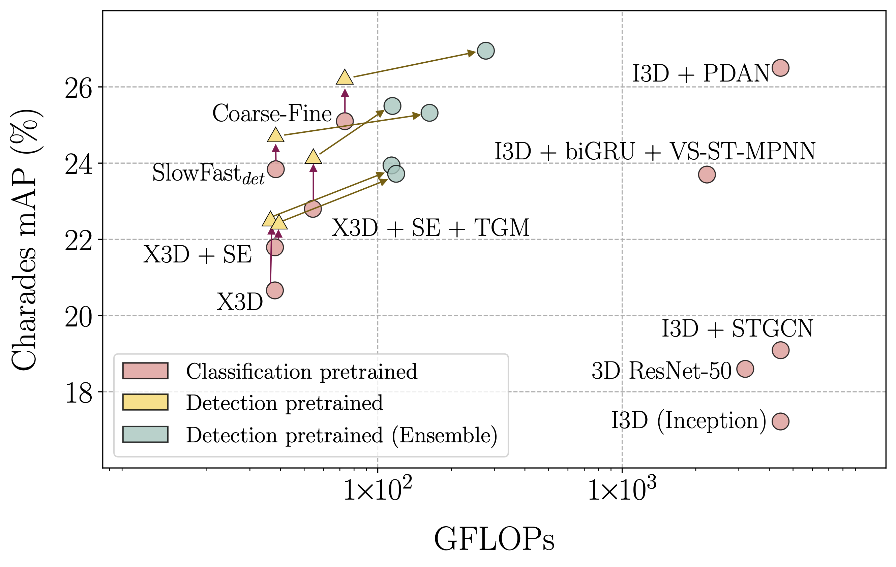

# Weakly-guided Self-supervised Pretraining for Temporal Activity Detection

This repository contains the official PyTorch implementation for our AAAI2023 paper titled "[Weakly-guided Self-supervised Pretraining for Temporal Activity Detection](https://arxiv.org/abs/2111.13675)".

### Introduction


Temporal Activity Detection aims to predict activity classes per frame, in contrast to video-level predictions in Activity Classification (i.e., Activity Recognition). Due to the expensive frame-level annotations required for detection, the scale of detection datasets is limited. Thus, commonly, previous work on temporal activity detection resorts to fine-tuning a classification model pretrained on large-scale classification datasets (e.g., Kinetics-400). However, such pretrained models are not ideal for downstream detection, due to the disparity between the pretraining and the downstream fine-tuning tasks. In this work, we propose a novel **weakly-guided self-supervised pretraining** method for detection. We leverage weak labels (classification) to introduce a self-supervised pretext task (detection) by generating frame-level pseudo labels, multi-action frames, and action segments. Simply put, we design a detection task similar to downstream, on large-scale classification data, without extra annotations. We show that the models pretrained with the proposed weakly-guided self-supervised detection task outperform prior work on multiple challenging activity detection benchmarks, including Charades and MultiTHUMOS. Our extensive ablations further provide insights on when and how to use the proposed models for activity detection.


We try to bridge the gap between classification-pretraining and downstream detection, by proposing a weakly-guided self-supervised pretraining task that closely resembles the downstream task. It shows similarities to both weak- (as we leverage weak labels) and self-supervision (as we design a pretext task based on augmentations). Specifically, we introduce frame-level pseudo labels followed by multi-action frames and action segments through a set of data augmentation strategies. By doing so, we benefit from the scale of data, while having a similar data distribution (in terms of having overlapping and segmented actions) as downstream detection.

First, we generate frame-level labels from the available video-level labels, by replicating the same label for every frame. Next, we design a self-supervised pretext task for detection on the pretraining data, by introduce action segments and multi-action frames similar to the downstream data. To do this, we propose three augmentation methods specifically for video data (i.e., spatio-temporal volume): (1) **Volume Freeze**, (2) **Volume MixUp** and, (3) **Volume CutMix**. In Volume Freeze, we randomly select a frame in a given clip, and replicate it for a random time interval. Assuming that there can not be an action without any motion, we call this frozen segment *Background*, and label it with a *new* background label (zero-label). It allows the model to differentiate motion variations, giving a notion of different action segments. With Volume MixUp, we introduce multi-action frames to pretraining clips, which originally have a single action per clip. More specifically, we combine randomly selected two clips with a random temporal overlap, so that the overlapping region contains two actions per frame. Here we preserve temporal consistency, by having seamlessly varying temporal alpha masks for each clip. It means, we have a smooth transition from one clip to the other within the temporal overlap. The labels for each clip are weighted with the corresponding temporal alpha mask to create soft labels. Similarly in Volume CutMix, we define an overlapping region between two clips and assign a seamlessly changing spatial window for each clip within this region. The labels for each clip are weighted with the corresponding area of each window to create soft labels.

### Results



Our method shows relative gains on multiple benchmarks (eg: [Charades](http://vuchallenge.org/charades.html), [Multi-THUMOS](http://crcv.ucf.edu/THUMOS14/download.html)) with multiple baselines (eg: [SlowFast](https://openaccess.thecvf.com/content_ICCV_2019/papers/Feichtenhofer_SlowFast_Networks_for_Video_Recognition_ICCV_2019_paper.pdf), [X3D](http://openaccess.thecvf.com/content_CVPR_2020/papers/Feichtenhofer_X3D_Expanding_Architectures_for_Efficient_Video_Recognition_CVPR_2020_paper.pdf), [Coarse-Fine](https://openaccess.thecvf.com/content/CVPR2021/papers/Kahatapitiya_Coarse-Fine_Networks_for_Temporal_Activity_Detection_in_Videos_CVPR_2021_paper.pdf)).

### Dependencies

- Python 3.7.6
- PyTorch 1.7.0 (built from source, with [this fix](https://github.com/pytorch/pytorch/pull/40801)). This issue is fixed in PyTorch >= 1.9 releases.
- torchvision 0.8.0 (built from source)
- accimage 0.1.1
- pkbar 0.5

### Quick Start

Edit the Dataset directories to fit yours, and,

- Use `python train_fine.py -gpu {gpu_num}` for training the Fine stream.
- Use `python extract_fineFEAT.py -gpu {gpu_num}` for extracting pre-trained features from Fine stream.
- Use `python train_coarse_fineFEAT.py -gpu 0,1` for training the complete Coarse-Fine Network.

Please note that we pre-extract the fine features, and use them to train the complete Coarse-Fine Network to reduce the burden on GPUs. One can train the two streams together to achieve a better performance given enough available compute. Our pre-trained models and training logs are available. Our final reported numbers on Charades are for the `Charades_v1_localize` evaluation setting as done in all the previous work. Here, predictions are made for 25 uniformly sampled frames per video instead of densely predicting for every frame. Use [this](http://vuchallenge.org/vu17_charades.zip) evaluation script to reproduce our reported numbers.

**Check out our implementation [X3D-Multigrid](https://github.com/kkahatapitiya/X3D-Multigrid) to understand more about the backbone X3D architecture and its efficient training strategy Multigrid.**

### Reference

If you find this useful, please consider citing our work:
```
@inproceedings{kahatapitiya2023ssdet,
  title={Weakly-guided Self-supervised Pretraining for Temporal Activity Detection},
  author={Kahatapitiya, Kumara and Ren, Zhou and Li, Haoxiang and Wu, Zhenyu and Ryoo, Michael S and Hua, Gang},
  booktitle={AAAI Conference on Artificial Intelligence},
  year={2023}
}

@inproceedings{kahatapitiya2021coarse,
  title={Coarse-Fine Networks for Temporal Activity Detection in Videos},
  author={Kahatapitiya, Kumara and Ryoo, Michael S},
  booktitle={Proceedings of the IEEE/CVF Conference on Computer Vision and Pattern Recognition},
  year={2021}
}
```

### Acknowledgements

I would like to thank the original authors of X3D [[CVPR2020]](http://openaccess.thecvf.com/content_CVPR_2020/papers/Feichtenhofer_X3D_Expanding_Architectures_for_Efficient_Video_Recognition_CVPR_2020_paper.pdf) and Multigrid training [[CVPR2020]](http://openaccess.thecvf.com/content_CVPR_2020/papers/Wu_A_Multigrid_Method_for_Efficiently_Training_Video_Models_CVPR_2020_paper.pdf) for their inspiring work.
